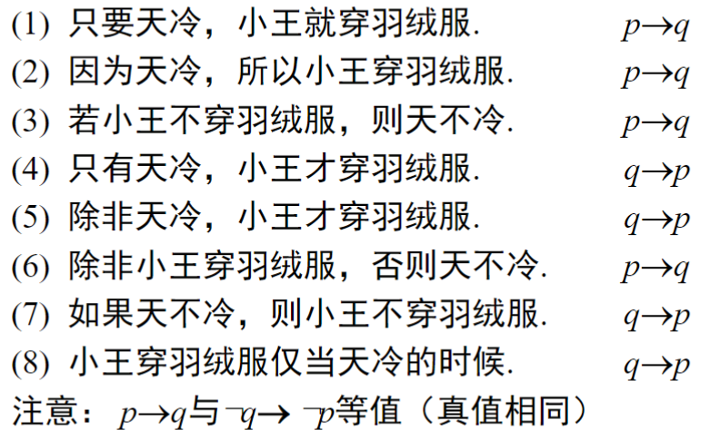
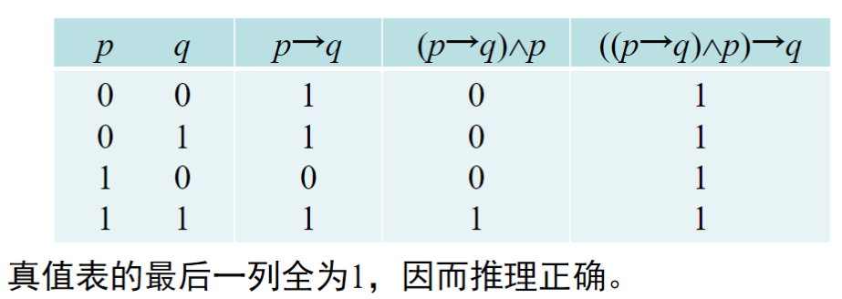
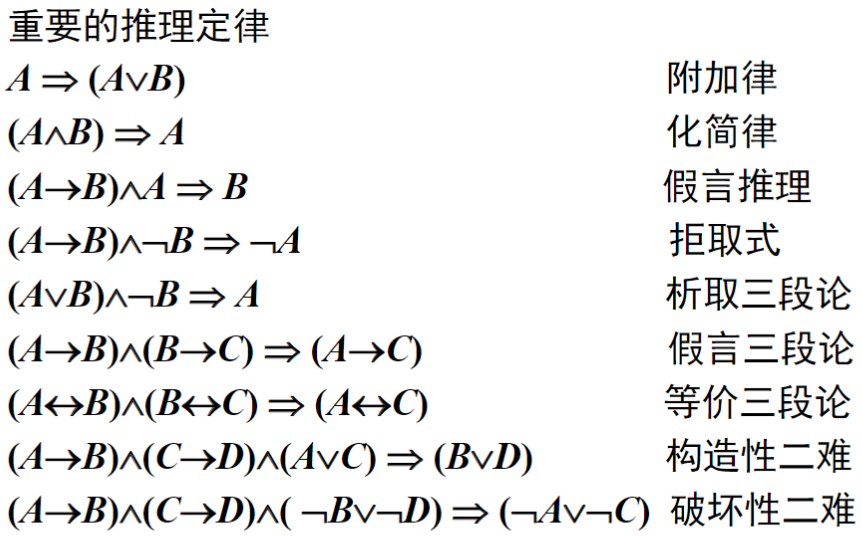

# 命题

## 判断是否为命题

1. 是否为陈述句
2. 真值是否唯一

## 简单命题

又称为**原子命题**，不能再分解为更简单的**陈述句**

## 复合命题

由若干**简单命题**用**联结词**组合成的命题

## 命题的符号

$$
\neg{p},非p，表示反 \tag{1.1}
$$

$$
a{\wedge}b,合取,表示与,也,\tag{1.2}
$$

### 将命题符号化

1. 李平既聪明又用功
2. 李平虽然聪明, 但不用功
3. 李平不但聪明,而且用功
4. 李平不是不聪明,而是不用功

$$
设p：李平聪明，q：李平用功
$$

$$
p{\wedge}q,p{\wedge}{\neg}q,p{\wedge}q,\neg{({\neg}p)}{\wedge}\neg{q}
$$

$$
ps:第四个需要注意
$$

$$
p\vee{q},析取,自然语言中的或,\tag{1.3}
$$

$$
p\rightarrow{q},表示蕴含,条件\tag{1.4}
$$

$$
当且仅当p真q假的时候蕴含为假,也就是不蕴含
$$

#### 蕴含的例题:

$$
p:天下雨,q:骑自行车上班
$$

$$
1.只要不下雨，我就骑自行车上班
$$

$$
\neg{p}\rightarrow{q}
$$

$$
2. 只有不下雨，我才骑自行车上班
$$

$$
q\rightarrow{\neg{q}}
$$

$$
*本质上是看谁推出谁,充分和必要的关系
$$

$$
p\leftrightarrow{q}\tag{1.5},等价联结词
$$

#### *拆分逻辑关系

$$
p\leftrightarrow{q}等价于(p\rightarrow{q})\wedge(q\rightarrow{p})
$$

$$
*互为充要条件
$$

$$
**双条件联结词连接的两个命题之间可以没有因果关系
$$

### 命题优先级顺序

$$
\neg,\wedge,\vee,\rightarrow,\leftrightarrow
$$

## 命题公式

### 命题常项

**简单命题**的真值是确定的,因而成为**命题常项**

### 命题变项

类似于$p$,本身不是命题,但是给定$x,y$后就存在真值.这种**真值可以变化**的**简单陈述句**被称为**命题变项**

#### **:命题变项不是命题!!!*

### 命题公式

若在复合命题中，$p,q,r $等不仅可以代表命题常项，还可以代表命题变项，这样组成的**复合命题形式**称为**命题公式**。

### 命题公式的生成规则:

1. 单个命题常项或命题变项$p,q,r,...,p_i,q_i,r_i,...$是命题公式；
2. 如果A是命题公式，则$¬A$也是命题公式；
3. 如果A和B是命题公式，则$A\wedge{B},A\vee{B},A\rightarrow{B},A\leftrightarrow{B}$均是命题公式；
4. 只有有限次地利用(1)~(3)形成的符号串才是命题公式。在命题逻辑中命题公式又称为合式公式，简称为公式。在公式中也可以出现1和0

#### **:以下不是命题公式*

$$
pq\rightarrow{r},\wedge{p}\rightarrow{q}
$$

### 命题公式的层数

1. 若$A$是单个命题常项或命题变项，则称$A$是0层公式
2. 称$A$是$n+1(n≥0)$层公式是指$A$符合下列情况之一
   $a. A=\neg{B}，B是n层公式。$
   $b. A=B\wedge{C}，B,C为i和j层,则n=\max{(i,j)}.人话就是大的加一层$
   $b. A=B\vee{C}，B,C为i和j层,则n=\max{(i,j)}.人话就是大的加一层$
   $\rightarrow和\leftrightarrow和上面相似$

#### **命题层数例题:*

$$
\neg(p\wedge{q}),p\rightarrow{(p\vee{q})},\neg(\neg{p}\wedge{q})\rightarrow(r\vee{s})
$$

$$
分别是2,2,4层
$$

$$
如果要快点看,那么p\vee{q}这种都是一层
$$

$$
第三个按照个人理解,应该是\neg(\neg{p}\wedge{q})
$$

$$
\neg{p}一层,\neg{p}\wedge{q}两层,\neg(\neg{p}\wedge{q})三层
$$

$$
最后在蕴含的时候取较大值3+1
$$

### 公式的解释或赋值

省流:赋值就是赋一组初始值,如011

#### 赋值方法:

1. 按字典顺序赋值
2. 按编号赋值

### 真值表

#### 真值表的构造步骤

1. 找出命题公式中所含的所有命题变项$p1,p2,...,pn$；
2. 按从低到高的顺序写出各层次；
3. 从$00...0(n位)$开始，按照二进制数从小到大列出所有可能的赋值，直到$11...1(n位)$为止。
4. 对应每个赋值，计算命题公式各层次的值，直到最后计算出命题公式的值。

**(中间可以省略部分步骤)*

### 命题公式分类

#### 重言式(永真式)

$$
(p\wedge{(p\rightarrow{q})})\rightarrow{q}
$$

#### 矛盾式(永假式)

...

#### 可满足式

...

## 等值验算

### 公式等值

若对于命题公式A,B,有

$$
A\leftrightarrow{B}
$$

为重言式,则称AB等价,即

$$
A\iff{B}
$$

### 德-摩根律

$$
\neg(A\vee{B})\iff{\neg{A}\wedge{\neg{B}}}
$$

$$
\neg(A\wedge{B})\iff{\neg{A}\vee{\neg{B}}}
$$

### 其他部分等价公式

$$
(A\vee{B})\vee{C}\iff{}A\vee(B\vee{C})\tag{结合律}
$$

$$
A\wedge(B\vee{C})\iff{}(A\vee{B})\wedge(A\vee{C})\tag{分配率}
$$

$$
A\vee(A\wedge{B})\iff{A}\tag{吸收率}
$$

$$
A\wedge(A\vee{B})\iff{A}\tag{吸收率}
$$

$$
A\vee0\iff{}A\wedge1\iff{}A\tag{01率}
$$

#### 很重要的

$$
A\rightarrow{B}\iff{\neg{A}\vee{B}}\tag{蕴含等值式}
$$

$$
A\rightarrow{B}\iff{\neg{B}\rightarrow{\neg{A}}}\tag{假言异位}
$$

$$
(A\rightarrow{B})\wedge(A\rightarrow{\neg{B}})\iff{\neg{A}}\tag{归谬论}
$$

#### **:一点例题*

**证明:**

$$
(p→r)\wedge(q→r)\iff(p\vee{q})→r
$$

**判断类型:**

$$
((p→q)\wedge{p})→q
$$

$$
¬(p→(p\vee{q}))\wedge{r}
$$

$$
p\wedge(((p\vee{q})\wedge{¬p})→q)
$$

### 等值演算与实际问题

设有A, B, C, D四人参加百米竞赛，观众甲，乙，丙分别对比赛的名次进行了预测：

| 甲           | C第一           | B第二           |
| ------------ | --------------- | --------------- |
| **乙** | **C第二** | **D第三** |
| 丙           | **A第二** | **D第四** |

比赛结束后发现甲，乙，丙每人预测的情况都是**各对一半**，试问实际名次如何（假设无并列名次出现）？

解：设$pi, qi, ri, si$分别表示A, B, C, D是第$i(i=1,2,3,4)$名，由于甲，乙，丙每人都各对一半，故有下面三个等值式：

$$
1. (r_1\wedge{¬q_2})\vee(¬r_1\wedge{q_2})\iff1
$$

$$
2. (r_2\wedge{¬s_3})\vee(¬r_2\wedge{s_3})\iff1
$$

$$
3. (p_2\wedge{¬s_4})\vee(¬p_2\wedge{s_4})\iff1
$$

然后有条件：

$$
(1)\wedge(2)\iff1
$$

C不能既第一又第二，B和C不能并列第二:

$$
r1\wedge{¬q2}\wedge{r2}\wedge{¬s3}\iff0
$$

$$
¬r1\wedge{q2}\wedge{r2}\wedge{¬s3}\iff0
$$

.......太多了,算了

#### (还没有复习) **:此处请复习你的作业*

##### ***P32***

  ***1.5*** *(5)—(8)*

##### ***P33***

  ***1.7 (8), (9)*** *真值表法*
  ***1.8***
  ***1.9***

## 范式

### 简单析取式/合取式

由**有限个命题变项*及其否定***构成的***合取/析取式***为简单***合取/析取式***

#### ***注意:***

1. 一个简单析取式是**重言式**当且仅当它同时含有某个命题变项及其否定式，如$p\vee{¬p}\vee{q}$.
2. 一个简单合取式是**矛盾式**当且仅当它同时含有某个命题变项及其否定式，如$p\wedge{¬p}\wedge{r}$

### 析取范式/合取范式

仅由有限个简单合取式构成的析取式称为析取范式($\vee$)
仅由有限个简单析取式构成的合取式称为合取范式($\wedge$)

#### 范式求解步骤

**1. 消去$\rightarrow和\leftrightarrow$**
**2. 否定联结词$\neg$的消去或内移**
**3. 使用分配率**

#### 范式存在定理

任一命题公式都存在与之等价的析取范式和合取范式。***存在但不唯一***

### 极小项

设有n个命题变项，若在**简单合取式**中每个命题变项与其否定有且仅有一个出现一次，则这样的简单合取式为极小项。

在极小项中，命题变项与其否定通常按下角标或字典顺序排列。

n个命题变项共可产生2n个不同的极小项，其中每个极小项都有且仅有一个成真赋值。

**在极小项中**，将命题变项看作1，命题变项的否定看作0，极小项记作

$$
m_i,i=(*...n个...*)_{10},*=0/1
$$

#### 主析取范式

设命题公式A中含**n个命题变项**，如果A的析取范式中的简单合取式**都是极小项** *(就是不重复出现)*，则称该析取范式为A的主析取范式。

***步骤:***

1. 求析取范式
2. 添加不存在的项,如不存在$p$,则添加$\wedge(p\vee{\neg{p}})$,展开
3. 消去重复出现的命题变项和极小项
4. 将极小项从小到大排列

或者使用真值表法也可以,找出成真赋值再转换为$m_i$即可

#### ***例题:***

某单位要在甲，乙，丙三人中选派1～2名出差，选派时需满足如下条件：

1. 若甲去，则丙同去；
2. 若乙去，则丙不能去；
3. 若丙不去，则甲或乙可以去。

**问有几种选派方案?**

算出主析取范式即可

### 极大项

定义和极小项相似,但是极大项自身是**简单析取式**$(\vee)$
在极大项中,相反地,将命题变项看为0,将命题变项否定看为1,且把极大项记作

$$
M_i,i=(*...n个...*)_{10},*=0/1
$$

$$
*:i的个数本质就是\neg符号的二进制表达
$$

相似地,公式A的合取范式中的简单析取式全是极大项，则称该合取范式为主合取范式。

#### 极大项和极小项的关系

$$
显然地,有\neg{m_i} = M_i,\neg{M_i} = m_i
$$

#### 一者求另一者

1. 求出A的主析取范式。
2. 写出以A的主析取范式中没出现的极小项的角码为角码的极大项。
3. 由这些极大项构成的合取式极为A的主合取范式
   人话就是角码上去补集

#### **：作业题（还没写）:*

请完成之前的作业

1.12  1.13（1）

## 联结词全功能集

### 真值函数

$$
n个命题变项的真值表给出了{\left\{ 0,1 \right.\}}^n到\left\{ 0,1 \right.\}的一个对应关系。
$$

$$
n元真值函数共有2^{2^n}个
$$

### 冗余的联结词/独立的联结词

$$
*:可以被集合中其他联结词定义的联结词为\textbf{冗余的联结词}
$$

$$
*:否则是\textbf{独立的联结词}
$$

$$
**:比如常用五个联结词中,只需要\neg和\wedge或者\vee即可
$$

### 联结词全功能收集

$$
设S是一个联结词集合，如果任何真值函数
$$

$$
都可以由仅含S中的联结词构成的公式表示，则称S是联结词全功能集。
$$

#### 极小全功能集

$$
一个联结词的全功能集中不含冗余的联结词，则称它是极小全功能集
$$

$$
*:可以有多个,元素个数一致,满足全功能条件即可
$$

## 推理理论

### 相关概念

$定义:$

$$
*前提:已知的命题公式
$$

$$
*结论:从前提触发应用推理规则推出的命题公式
$$

$$
*推理:从前提推出结果的过程
$$

#### 注意:推理正确不能保证结论正确

#### 判断推理是否正确的方法

### ***:推理定律*

