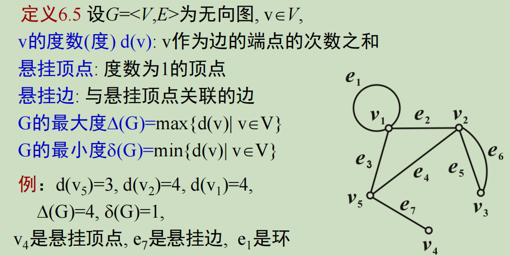
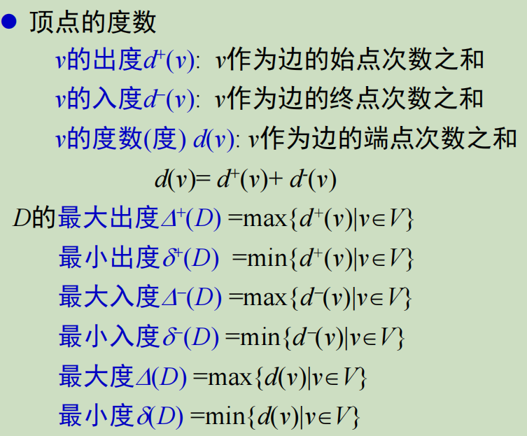
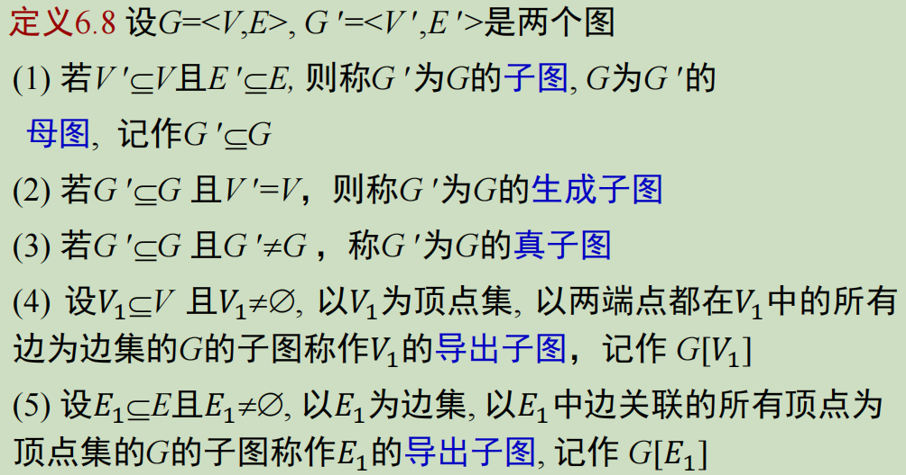
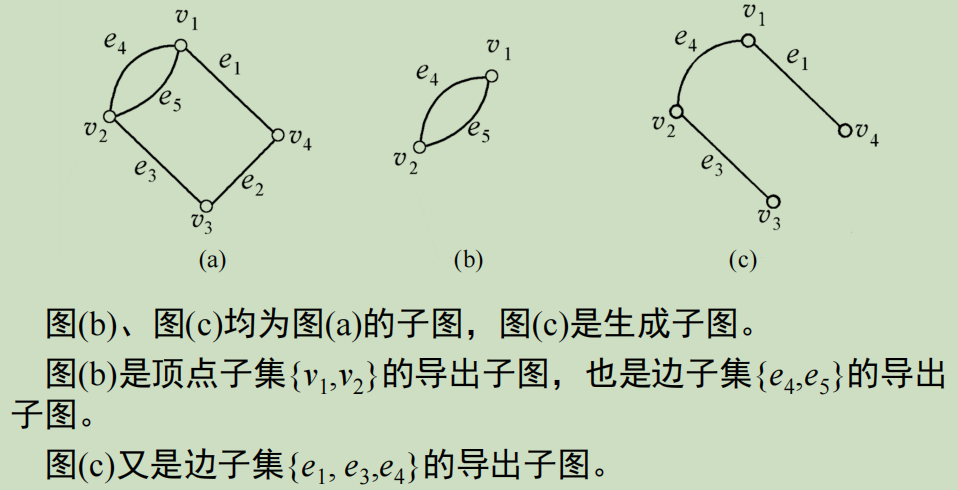
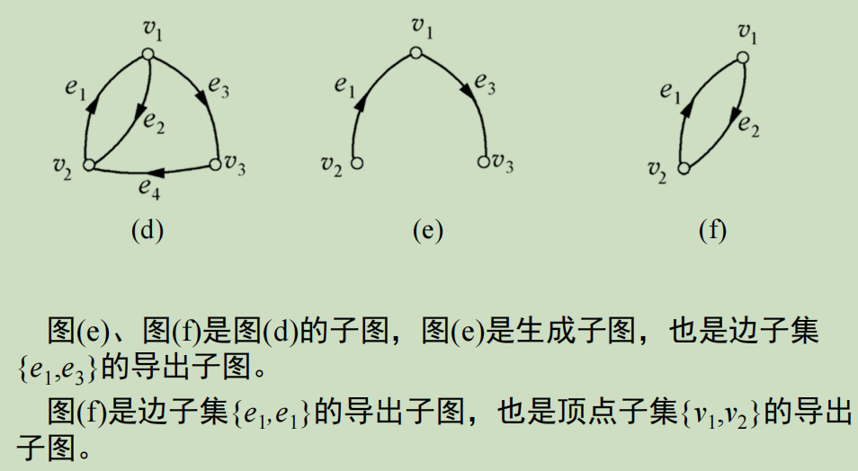

## 有向图

### 常用概念

1. **顶点(节点)、边、基图**
2. **通常用G表示无向图,D表示有向图,常用G泛指无向图和有向图。**                                       **（注意空图和零图的区别）**
3. **顶点和边的关联和相邻**即**边与某顶点关联，点与点/边与边相邻，关联次数0/1/2**
4. **环**
5. **顶点的度数****注意悬挂顶点、悬挂边。悬挂环**

   **出度和入度****握手定理:**

   $$
   |{E}|=m,\sum_{i=1}^nd(v_i)=2m
   $$
6. **度数序列**
7. **多重图和简单图****（有向图中的平行边是带方向的）**
8. **完全图****有向图中的完全图也是带方向的**
9. **子图、母图**

   子图和母图是完全的属于和被属于关系；生成子图需要顶点相同；真子图是不完全相同的子图；导出子图分为两种，**以中括号内的部分为框架，框架之间的部分完全保留（注意，仍然是G的子图，所以是完全保留）可以*****用假设法判定到底是边集的导出子图还是点集的导出子图***
10. **补图：等顶点，边为补集**
11. **图的同构：判断方法可以用矩阵法画子图：i条边和n-i条边的图互补**
12. **通路、回路、连通性**
