## 有向图

### 常用概念

1. **顶点(节点)、边、基图**
2. **通常用G表示无向图,D表示有向图,常用G泛指无向图和有向图。**                                       **（注意空图和零图的区别）**
3. **顶点和边的关联和相邻**即**边与某顶点关联，点与点/边与边相邻，关联次数0/1/2**
4. **环**
5. **顶点的度数****注意悬挂顶点、悬挂边。悬挂环**

   **出度和入度****握手定理:**

   $$
   |{E}|=m,\sum_{i=1}^nd(v_i)=2m
   $$
6. **度数序列**
7. **多重图和简单图****（有向图中的平行边是带方向的）**
8. **完全图****有向图中的完全图也是带方向的**
9. **子图、母图**

   子图和母图是完全的属于和被属于关系；生成子图需要顶点相同；真子图是不完全相同的子图；导出子图分为两种，**以中括号内的部分为框架，框架之间的部分完全保留（注意，仍然是G的子图，所以是完全保留）可以*****用假设法判定到底是边集的导出子图还是点集的导出子图***
10. **补图：等顶点，边为补集**
11. **图的同构：判断方法可以用矩阵法画子图：i条边和n-i条边的图互补**
12. **通路、回路、连通性****通路是vevevev(必须是相邻的)的序列，回路是首尾相连的序列，*简单通路*是所有边互不相同的通路，*初级通路*是顶点互不相同的简单通路(也叫路径)**`<反之称为复杂通路或回路>`**，或者初级回路(圈)初级<简单最后一点注：简单图无平行边无环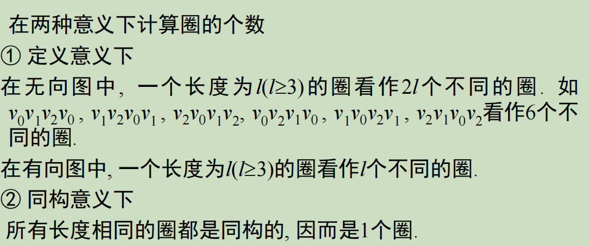**
13. **连通性**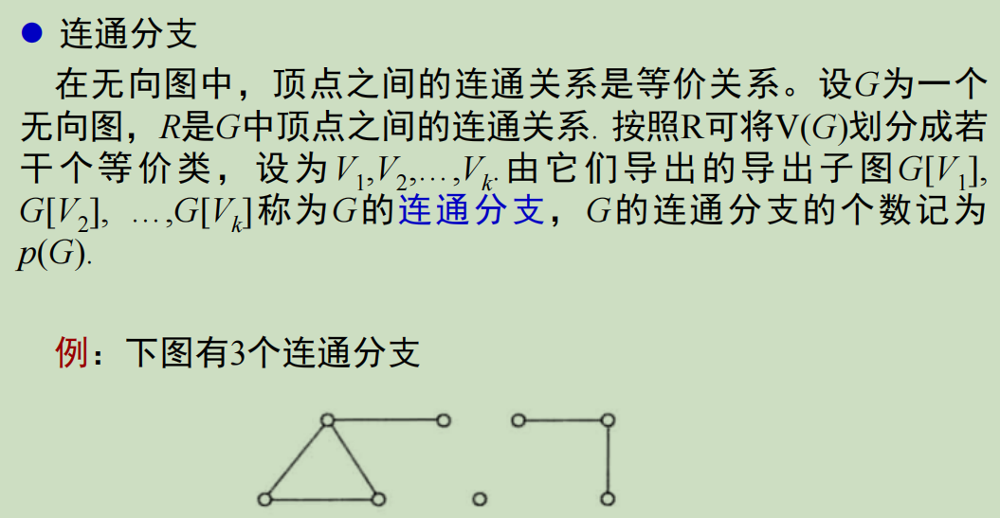上述都是对于无向图而言的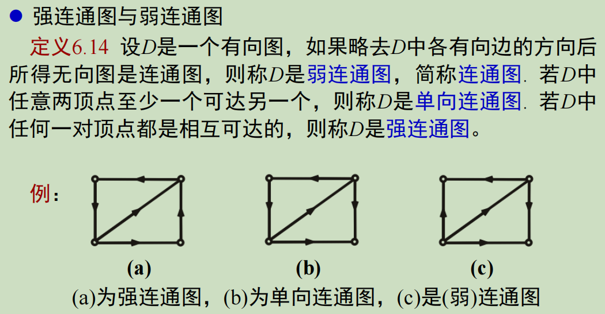**即是否考虑方向。(范围)强连通图<单向连通图<弱连通图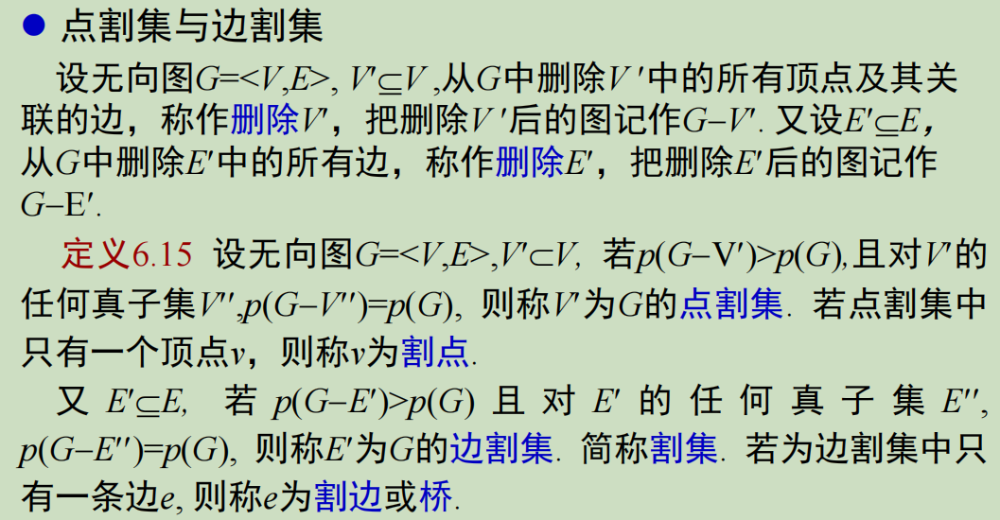即删除后联通的部分数量增加；若某x割集的真子集也是x割集，那么它不是x割集**
14. **关联矩阵表示法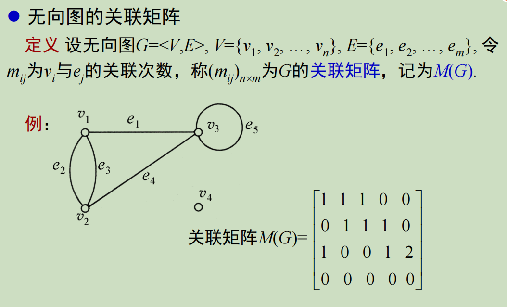横轴是$e_j$，纵轴是$v_j$有向图的：**
15. **有向图的邻接矩阵始点是纵轴(i)，终点是横轴(j),比如第一列是$v_1$作终点的情况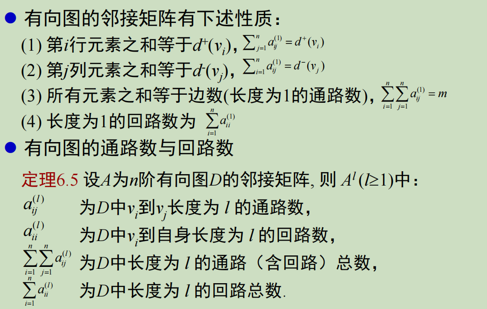这个定理很重要。元素之和是通路总数，trace是回路总数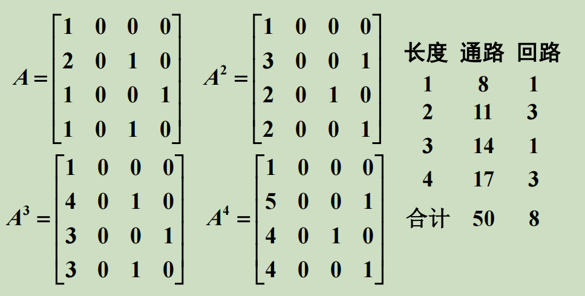**
16. **有向图的可达矩阵**
17. **带权图和迪杰斯特拉算法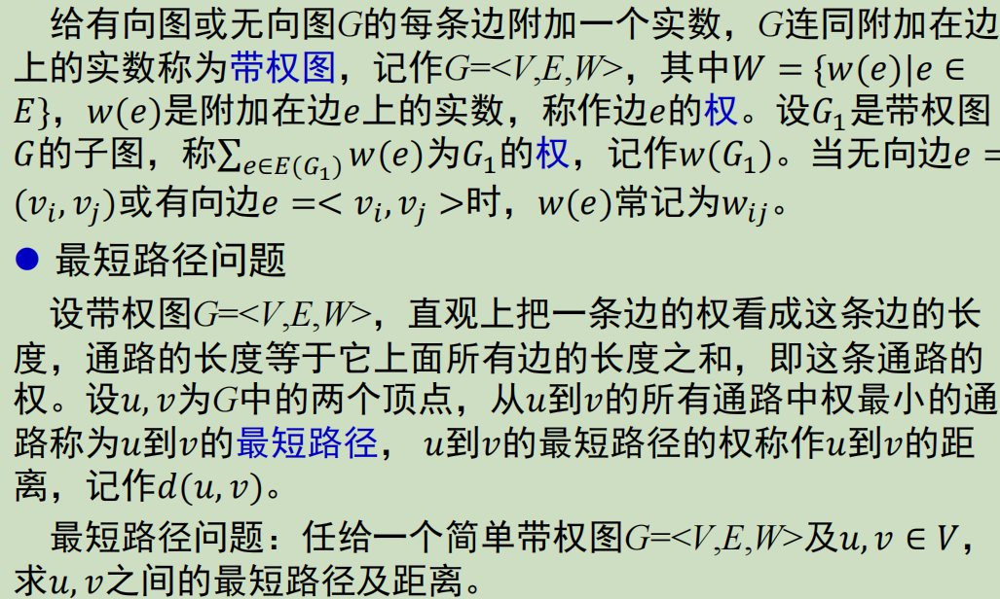很重要，作业可以写一下**
18. **关键路径问题？？？？？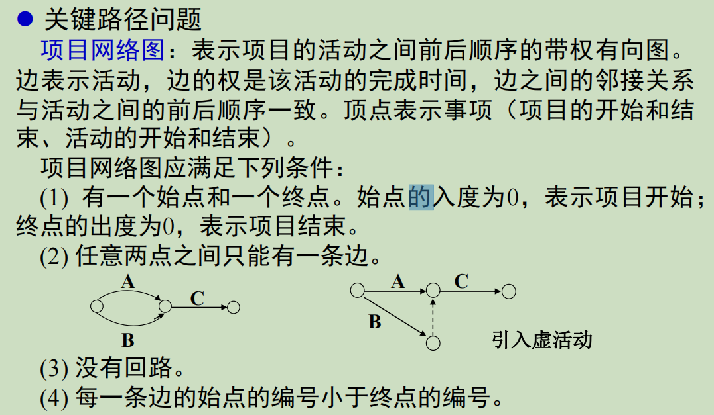关键路径是最长不是最短。对最早开始时间的理解：**
19. **着色问题应用：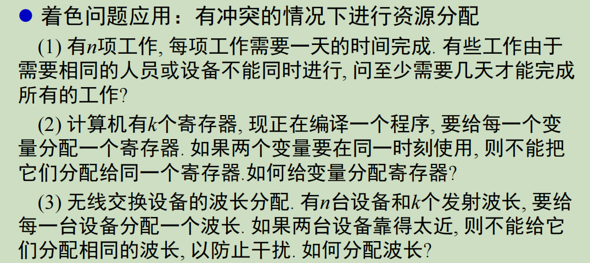**
20. **二部图：匹配、极大匹配、完美匹配：完美匹配：边数最多的匹配；完美匹配：匹配中边关联了所有顶点(匹配是边集，没有点)完备匹配(数量相等)：Hall定理(废话)：**
21. **欧拉回路和欧拉图(注意首尾是否相等)**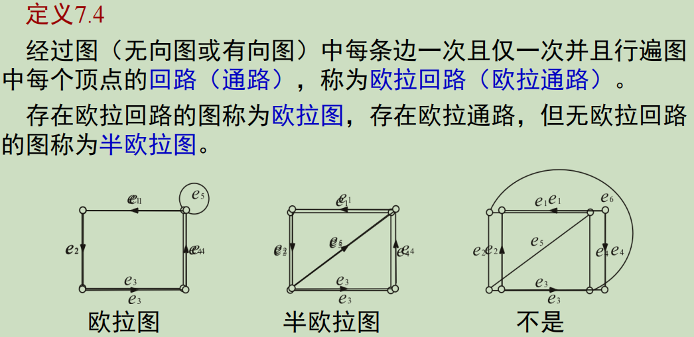**判别方法：**
22. **哈密顿图(经过所有顶点)？？？？证明条件：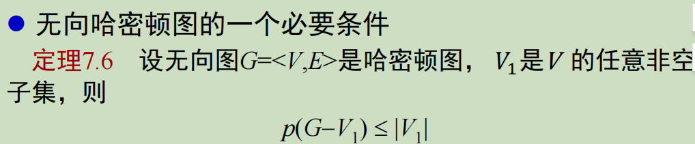有向图的条件：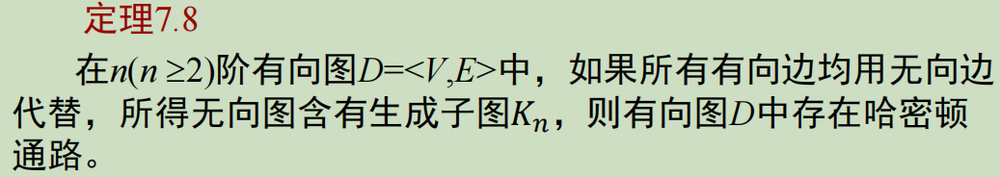哈密顿图解决实际问题(分别使用了两个定理)：哈密顿图和欧拉图：**欧拉图和哈密顿图区别只有一个**，就是结点或路径是否能重复。**欧拉图是每个结点都是偶结点的无向图，欧拉回路是不重复地走过所有路径的回路。哈密顿图是有哈密顿回路的图，哈密顿回路是不重复地走过所有的点并且最后还能回到起点的回路。**欧拉图和哈密顿图的区别在于欧拉图是生成简单回路(无环)，而哈密顿图是生成初级回路(顶点各不相同)。**

$$
由推论知，对于完全图K_n,当n>=3时，是哈密顿图
$$

$$
完全二部图K_{r,s}当r=s>=2时是哈密顿图。
$$

23. 平面图、平面嵌入**平面图的所有面的次数之和等于边数的2倍$n(n≥3)$阶简单平面图是极大平面图(必须是简单图)当且仅当它连通且每个面的次数都为3。**
24. **平面图的性质**

+ 欧拉公式(),设G是有$n$阶$m$条边$r$个面,$p(p≥2)$个连通分支的平面图, 则：

  $$
  n-m+r=p+1
  $$
+ 设G为$n$阶$m$条边的连通平面图, 每个面的次数不小于$l (l≥3)$, 则:

  $$
  m≤\frac{l}{l-2}(n – 2)
  $$
+ 若还有$p(p>2)$个连通分支，则:

  $$
  m≤\frac{l}{l-2}(n-p-1)
  $$
+ 同胚与收缩

+ 平面图判定：一个图是平面图当且仅当它没有可收缩到$K_5$同胚的子图，也没有可收缩到$K_{3,3}$同胚的子图。
+ 对偶图

25. 树
+ **不含回路的连通无向图称为无向树**，简称树。每个连
通分支均是树的非连通无向图称为**森林**。**平凡图(仅有一个顶点)称为平凡树**。
树中度数为1的顶点称为**树叶**，度数大于等于2的顶点称为**分支点**。
+ 性质：