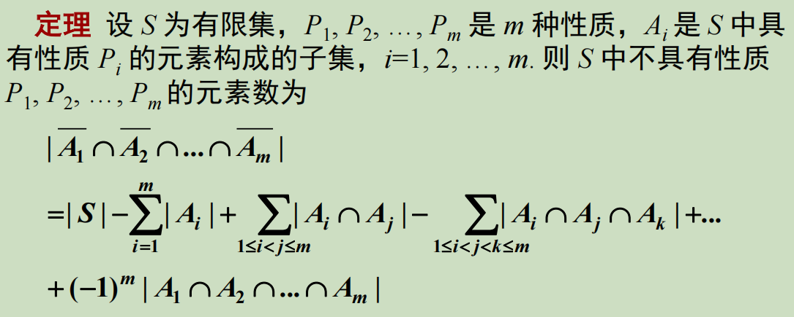
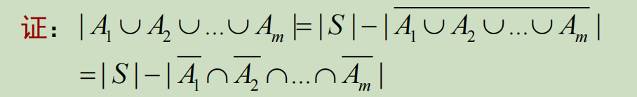
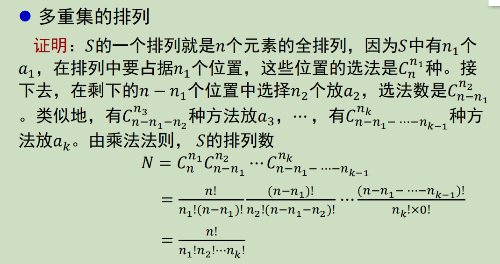
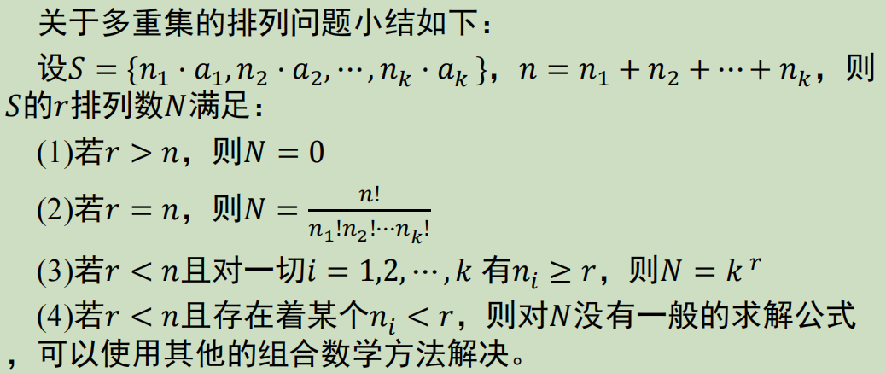
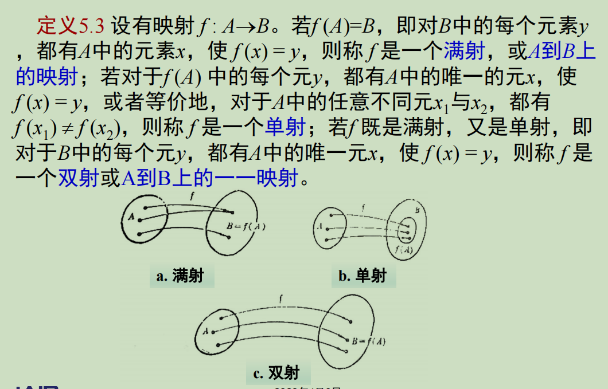
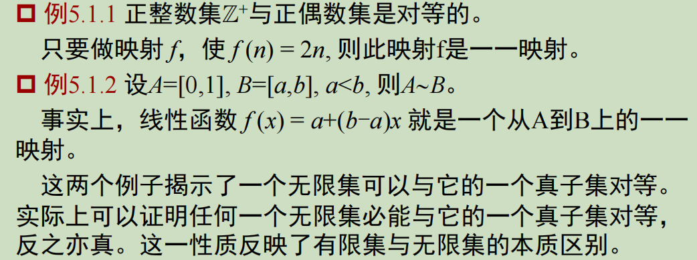

## 容斥原理

## 排列组合的计数方法

## 推论-多重集的排列

### S的排列数

### 多重集合排列的小结

## 多重集的组合

定义$S=\{n_1*a_1,n_2*a_2,...,n_k*a_k\}$,$S$的含有$r$个元素的子多重集成为$S$的$r$组合

#### *不相邻的组合数

**一.从n个球中选出r个球，要求这r个球互不相邻，有多少种取法？**

分析：
①当n<2r-1时，取法为0种
例如4个球里取3个互不相邻的球，找不到这样的组合
②n≥2r-1时，取法为$C_{n-r+1}^{r}$种
这里考虑逆向思维。假设我们先从$n-r+1$个球中任意取$r$个	球，组合数为 $C_{n-r+1}^{r}$
*（临界情况：n=2r-1时，比如5个里取3个，7个里取4个，此时恰好只有$C_{n-r+1}^{r}$=$C_{r}^{r}$=$1$种取法）*

**二.从围成一圈的n个球中选出互不相邻的r个球有多少种不同的选法？**

分析：
①当$n<2r$时，取法为0种
例如4个球围一圈，选互不相邻的3个球，找不到这样的组合
①当$n>=2r$时，取法为$\frac{n}{n-r}C_{n-r}^{r}$种
首先对球进行编号，$1\rightarrow n$号，对于任何可能的组合，都只有两种情况：包含1号球的和不包含1号球的。

包含1号球：首先选出1号球，然后需要从3号球~n-1号球取出r-1个互不相邻的球，根据上面那道题的结论，我们可以得到组合数为

$$
C_{n-3-(r-1)+1}^{r-1}=C_{n-r-1}^{r-1}
$$

不包含1号球：我们需要从2号球~n号球取出r个互不相邻的球，其组合数为

$$
C_{n-1-r+1}^{r}=C_{n-r}^{r}
$$

综上，总数为

$$
C_{n-r-1}^{r-1}+C_{n-r}^{r}=\frac{n}{n-r}C_{n-r}^{r}
$$

（临界情况：当n=2r时，例如4个取2个，6个取3个，共有$C_{r}^{r}*\frac{2r}{r}=2$种）

## 映射、对等与可数集

### 双射、单射、满射

### 集合的对等

设A与B是两个非空集合，若存在一个从A到B上的一一映射，则称集合A与B是对等的，或称A与B是一一对应的，记作A~B。

**例：**

### 可数集

凡与正整数对等的集合称为可数集（或可列集）
