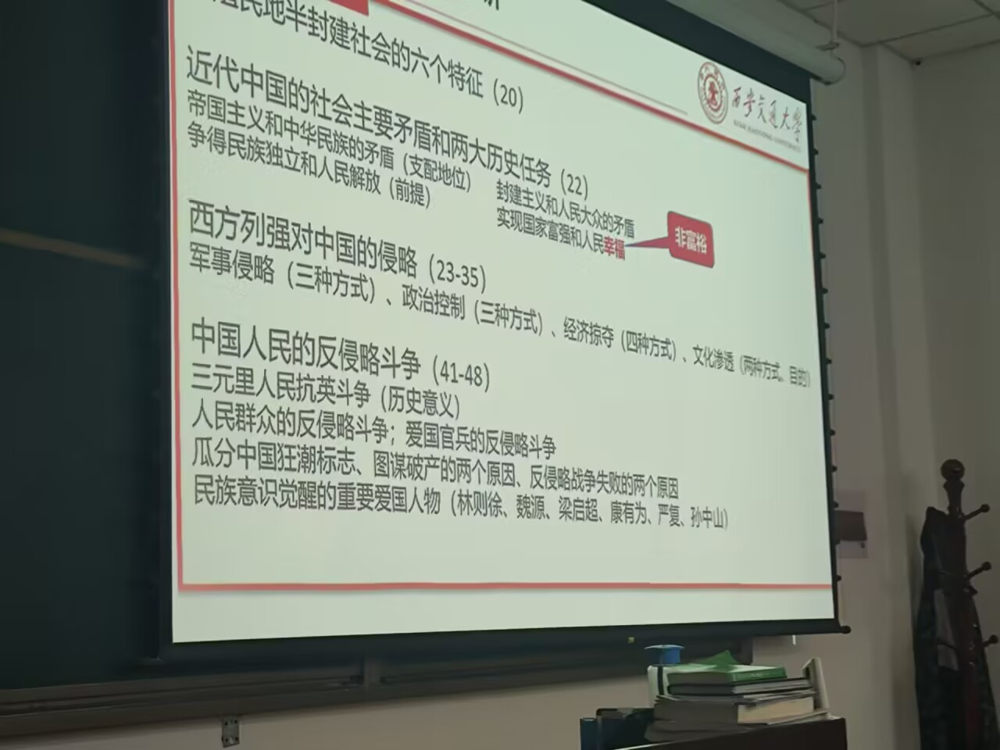
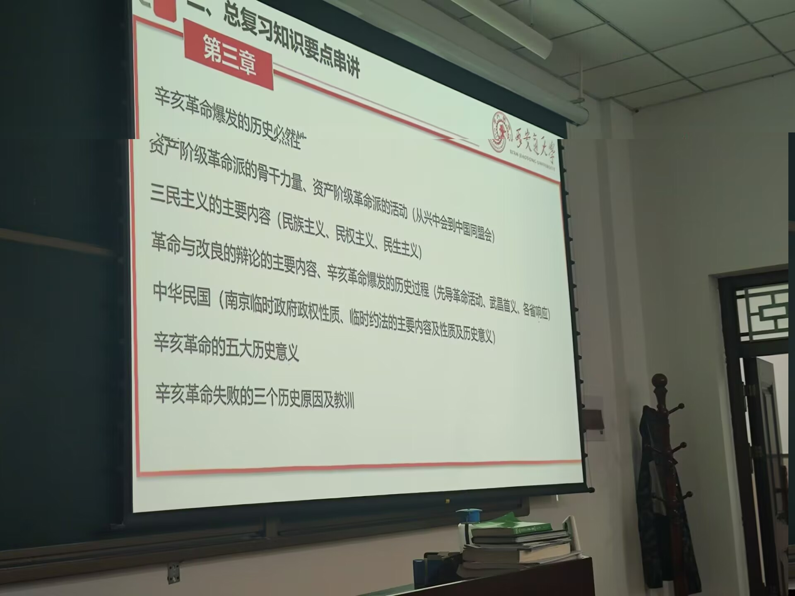
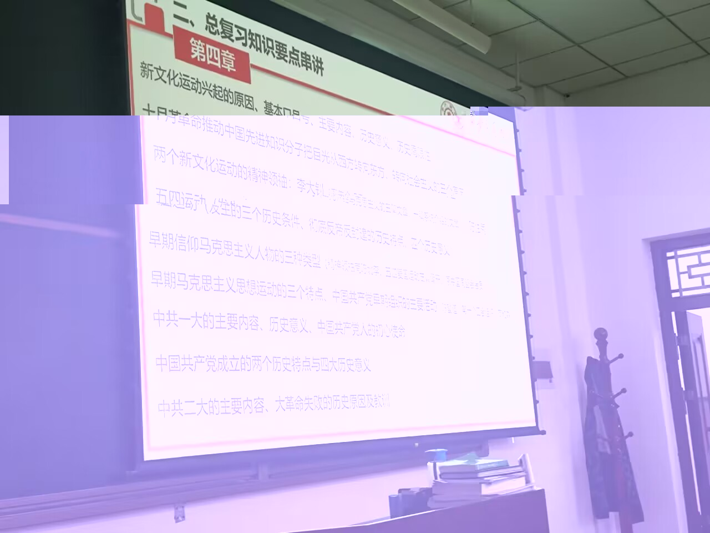
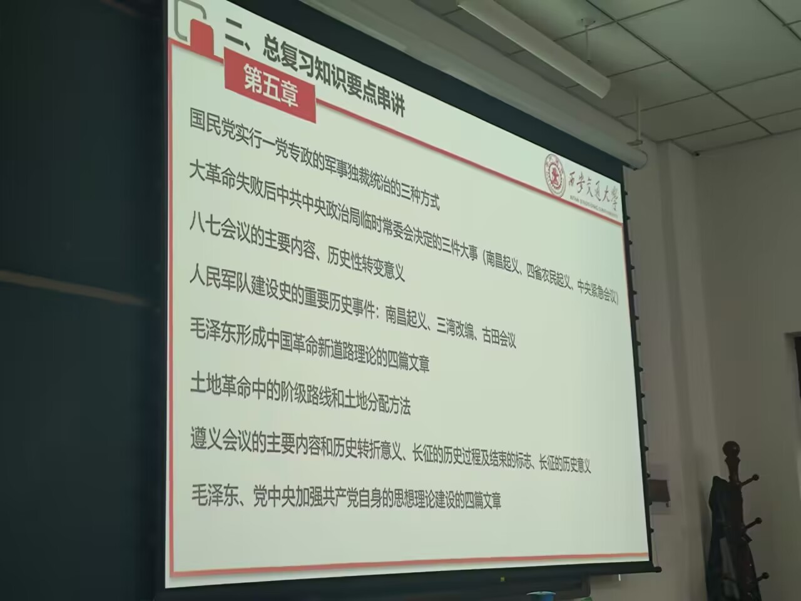
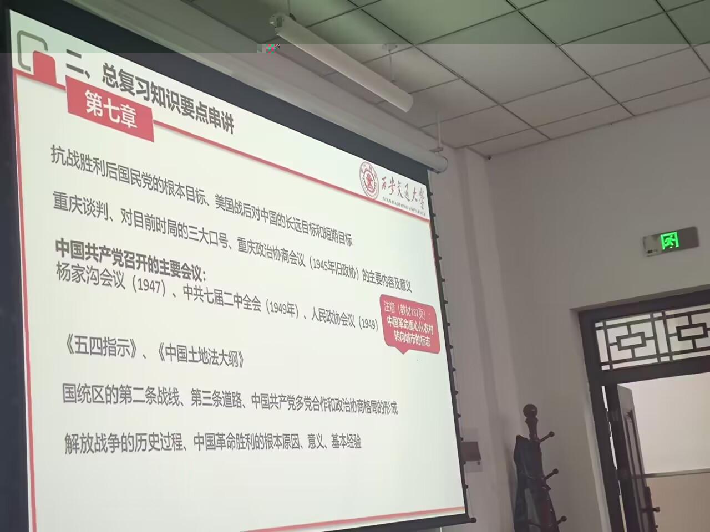

# 第一章

## 半殖民地半封建社会的六个特征(20)

1. <势力1>资本-帝国主义侵略势力操纵:财政和**经济**命脉--->**政治**
1. <势力2>封建势力**日益衰败**,与侵略势力勾结,成为侵略势力压迫,奴役人民的**社会基础和统治支柱**
1. <经济制度>**自然经济基础遭到破坏**,但***封建地主的土地所有制*仍然广泛保留**,阻碍发展进步
1. <势力3>民族新兴资本主义**已经产生**,但在**双重压迫**下力量弱小,且与两股势力有或多或少联系(成分不纯)
1. <领土主权>(由于历史遗留原因)近代地域政治经济文化发展**极不均衡**,列强支持地方势力以**分裂中国**,使中国**处于不统一**
1. <人民状态>**双重压迫**(后来还有**官僚资本主义)**下,广大劳动人民**贫困化**,**饥寒交迫且毫无政治权利.**

## 近代中国主要社会矛盾和两大历史任务

### 矛盾

1. 帝国主义和中华民族的矛盾(支配地位)
2. 封建主义和人民大众的矛盾

### 两大历史任务

1. 取得民族独立和人民解放(前提)
2. 实现国家富强和人民幸福

## 西方列强的侵略

### 军事侵略

1. 发动侵略战争、屠杀中国人民
2. 侵占中国领土、划分视力范围
3. 勒索赔款、掠夺财富

### 政治控制

1. 控制中国的内政、外交
2. 镇压中国人民的反抗
3. 扶植、收买代理人

### 经济掠夺

1. 控制中国的通商口岸
2. 掠夺中国的关税自主权
3. 实行商品倾销和资本输出
4. 操纵中国的经济命脉

### 文化渗透

1. 披着宗教外衣、进行侵略活动
2. 为侵略中国制造舆论

## 中国人民的反侵略斗争(41-48)

### 三元里抗英(历史意义)

#### 历史意义：

  中国近代史上中国人民第一次大规模的反侵略武装斗争，显示了中国人民不甘屈服和敢于斗争的英雄气概。

### 人民群众的反侵略斗争；爱国官兵的反侵略斗争

#### 人民群众的反侵略斗争

1. 三元里抗英
2. 太平军多次重创侵略者
3. 台湾人民的反抗
4. 中法战争香港造船工人罢工
5. 马关条约台湾罢市
6. 八国联军侵华时义和团的反抗

#### 爱国官兵的反侵略斗争

1. 左宗棠收复新疆
2. 中法战争-冯子材
3. 甲午战争-丁汝昌、邓世昌、林永升、林泰曾

### 瓜分中国狂潮标志、图谋破产两个原因、反侵略战争失败两个原因

#### 瓜分中国狂潮标志

  1895年《马关条约》时，日本索要“赎辽费”；后1898-1899，德、俄、英、法、日等国竞相租借港湾和划分势力范围，掀起了瓜分中国狂潮。

#### 图谋破产两个原因

1. 帝国主义列强之间的矛盾和相互制约(重要原因)
   - 决定暂缓瓜分中国，借由清政府以华制华
2. 中华民族进行的不屈不挠的反侵略斗争
   - 义和团运动

#### 反侵略战争失败的两个原因

1. 社会制度的腐败(根本)
   - 正是腐败的中国半殖民地半封建的社会制度，阻碍了中国人民群众的广泛动员和抵抗
2. 经济技术的落后

### 民族意识觉醒的重要爱国人物

#### 师夷长技以制夷与早期维新思想

1. 开眼看世界第一人-林则徐-《四洲志》
2. 提出“师夷长技以制夷”-魏源-《海国图志》

#### 救亡图存和振兴中华

1. 梁启超-保国会演说
2. 严复-《救亡决论》《天演论》
3. 孙中山-兴中会

# 第二章

# 第三章

## 辛亥革命爆发的历史必然性

### 民族危机加深、社会矛盾激化

  在国内外反动派的严重压迫下，各阶级的斗争风起云涌。资产阶级开始成为主要角色

### 清末“新政”破产

- 1901年实行“新政”，1906废除科举、宣布预备立宪，1908《钦定宪法大纲》
- 其本质是延续其反动统治

### 资产阶级的力量发展

- 随着民族资本主义企业数量的增多和规模的扩大，民族资产阶级及和它相联系的社会力量也有了明显的发展
- 资产阶级需要自己政治利益的代言人和经济利益的维护者---**阶级基础**

## 资产阶级革命的骨干力量、革命派的活动

### 骨干：

  资产阶级的革命派的骨干是一批**资产阶级、小资产阶级知识分子**。这些青年知识分子成为辛亥革命的中坚力量

## 三民主义主要内容

+ 一个较为完整而明确的资产阶级民主革命纲领

### 民族主义

1. 驱除鞑虏：以革命手段推翻清政府，改变它一贯推行的民族歧视和民族压迫政策
2. 恢复中华：建立中华民族“独立的国家”

- 民族主义不是简单的排满，而是结束清政府的专制统治以及媚外政策
- 没有从正面提出反对帝国主义的主张
- 没有明确把汉族军阀、官僚、地主作为革命对象

### 民权主义

- 内容：创立民国，推翻封建君主专制制度，建立资产阶级民主共和国。(政治革命)
- 虽然强调要建立民主共和国，却忽略了广大劳动群众在国家中的地位，难以真正保证人民的民主权利

### 民生主义

- 平均地权，社会革命
- 没有正面触及封建土地所有制，不能满足广大农民的土地要求，难以成为发动广大工农群众的理论武器

## 革命与改良辩论的主要内容、辛亥革命过程

### 辩论

#### 要不要以革命手段推翻清王朝

#### 要不要推翻帝制，施行共和

#### 要不要进行社会革命

### 革命过程

#### 武装起义与保路风潮

1. 1911年4月27，广州黄花岗起义-黄花岗72烈士
2. 1911年5月清政府把铁路收归国有、四川总督赵尔丰枪杀情愿群众，在同盟会参与下，爆发了全川的武装暴动
3. 1911年10月10日，武昌起义，光复武汉三镇，成立湖北军政府
4. 一个月内13省相应，1912年2月12日清帝退位

## 中华民国

### 南京临时政府政权性质

+ **南京临时政府是一个资产阶级共和国性质的革命政权**
+ 集中代表和反映了民族资产阶级的愿望和利益，在相当程度上也符合广大中国人民的利益
+ 局限性：
  + 试图承认外债以获得列强承认政权
  + 没有提出任何可以满足农民土地要求的政策和措施，反而维护封建土地制度以及官僚、地主所占有的土地和财产

### 临时约法

+ 中国历史上第一部具有资产阶级性质共和国宪法性质的法典
+ 废除了君主专制，确认了资产阶级共和国的政治制度
+ 不完全的、有缺点的、资产阶级性的，有革命性和民主性

## 辛亥革命五大历史意义

1. 推翻了封建势力的政治代表、帝国主义在中国的代理人清王朝的疼痛·统治，沉重打击了中外反动势力，使中国反动统治者在政治上乱了阵脚。
   在此之后，帝国主义和封建势力在中国再也无法建立比较稳定的统治。
2. 结束了君主专制，建立起资产阶级共和政府，民主共和深入人心。
3. 推动了思想解放，动摇了皇权的神圣小，激发了爱国热情和民族觉醒，打破了思想禁锢。
4. 推动了社会变革，使中国的社会经济、思想习惯、社会风俗等发生了新的积极的变化。
5. 一定程度打击了帝国主义的侵略势力，促进了亚洲民族解放运动。

## 辛亥革命失败的原因和教训

### 辛亥革命失败的原因和教训

+ 根本上，在帝国主义时代、半殖民半封建的中国，资本主义建国方案行不通。导致了内外势力的联合绞杀。
+ 具体原因：

  1. 没有提出彻底的反帝反封建纲领
  2. 不能充分发动和依靠人民群众
     中国民族资产阶级和封建势力有一定联系，不敢依靠反封建主力军农民群众。在清政府被推翻后，也并没有进一步领导农民反封建斗争。
  3. 不能建立坚强的革命政党，以作为团结一切革命力量的强有力的核心。
+ 这些问题，根源于中国民族资产阶级的软弱性和妥协性。
+ 辛亥革命没有改变封建主义和军阀官僚政治的统治基础，无法完成反帝反封建的任务。

# 第四章

## 新文化运动

### 兴起的原因

+ 先进的知识分子认为救亡需要改造中国国民性。决心发动一场新的启蒙运动，将人们从封建思想的束缚中解放出来。

### 基本口号

+ 拥护德先生和赛先生，即**提倡民主和科学**

### 主要内容

1. 以进化论观点和个性解放思想为主要武器，抨击以孔子为代表的“往圣先贤”
2. 提倡新道德、反对旧道德
3. 提倡新文学、反对旧文学(包括提倡白话文、反对文言文)

### 历史意义

1. 通过批判孔学，动摇了封建正统思想的统治地位，掀起了思想解放的潮流。
2. 客观上促进了资产阶级民主主义的提倡。
3. 冲决了禁锢人们思想的阀门。

### 历史局限性(五四以前)

1. 新文化运动的倡导者批判孔学，是为了给中国发展资本主义扫清障碍，但资产阶级共和国的道路根本上行不通。并不能有效的指导进行社会改造。
2. 将改造国民性置于优先地位，但离开必要的革命实践，仅靠少数人和那好，依靠有限的宣传手段，要根本改造由这种社会环境所产生的的思想、所造成的国民性，是不可能的。
3. 缺乏马克思主义的批判精神，仅仅使用资产阶级的方法，看问题过于片面和绝对。

### 两个新文化运动的精神领袖

#### 李大钊

+ 率先介绍马克思主义的三篇文章(《法俄革命值比较观》《庶民的胜利》《布尔什维克的胜利》)，一篇系统介绍的文章(《我的马克思主义观》)
+ 标志马克思主义进入比较系统的传播阶段

#### 陈独秀

## 十月革命

### 十月革命推动革命者转向社会主义的原因

1. 十月革命发生在与中国国情相同(封建压迫严重)或近似(经济文化落后)的俄国。
2. 社会主义俄国号召反对帝国主义，并以平等的态度对待中国，有力地推动了社会主义思想在中国的传播。
3. 十月革命中工人、农民和士兵群众的广泛发动并由此取得胜利的事实，给予先进分子新革命方法的启示。

## 五四运动

### 三个历史条件

1. 新的社会力量的成长壮大，资产阶级和工人阶级进一步成长(一战期间资本主义经济得到发展)。
2. 新文化运动掀起的思想解放潮流，年青一代知识界为五四运动准备了最初的群众队伍和骨干力量。
3. 俄国十月革命对中国的影响。

### 历史特点

+ 是一场以先进青年知识分子为先锋、广大人民群众参加的***彻底反帝反封建的伟大爱国革命运动***
+ 是一场中国人民为拯救民族危亡、捍卫民族尊严、凝聚民族力量而掀起的***伟大社会革命运动***
+ 是一场传播新思想新文化新知识的***伟大思想启蒙运动和新文化运动***，以磅礴之力鼓动了中国人民和中华民族实现民族复兴的志向和信心。

### 四个历史意义

1. 旧民主主义革命走向新民主主义革命的转折点。
2. 以全民族的力量高举爱国主义的伟大旗 帜，孕育了爱国、进步、民主、科学的伟大五四精神。
3. 以全民族的行动激发了追求真理、追求进步的伟大觉醒；发动了群众的第一次全面觉醒。
4. 以全民族的搏击培育了永久奋斗的伟大传统。

## 马克思主义

### 早期马克思主义队伍的三类人

1. 新文化运动的精神领袖-李大钊、陈独秀(先驱者、擎旗人)
2. 五四爱国运动的左翼骨干-毛泽东、杨匏安、蔡和森、周恩来(主体部分)
3. 原中国同盟会成员-董必武

### 早期马克思主义运动的三个特点

1. 重视对马克思主义基本理论的学习，明确地同社会民主主义划清界限。(一开始就坚持了马克思主义的革命原则和正确方向)
2. 注意从中国的实际出发，学习、运用马克思主义。(在实际上初步形成了马克思主义应当与中国具体实际相结合的思想)
3. 开始提出知识分子应当同劳动群众相结合的思想(重要开端)

## 中国共产党

### 党早期组织的主要活动

#### 党早期组织

+ 李大钊-马克思学说研究会-最早的学习和研究马克思主义的团体
+ 1920-5-陈独秀-马克思主义研究会-上海早期党组织(中国共产党的发起组织，党建活动的联络中心)
+ 1920-10-李大钊-北京共产党早期组织-(更名)->中国共产党北京支部
+ 其他地方的共产党早期组织
+ 党早期组织的工作
  1. 研究和宣传马克思主义、研究中国实际问题

     + 陈望道翻译《共产党宣言》
  2. 到工人中去进行宣传和组织工作

     + 共产党早期组织领导的第一个工会：上海机器工会
  3. 进行关于建党问题的讨论和实际组织工作

     + 蔡和森提出建立共产党的相关主张

### 中共一大

#### 主要内容-P107

+ 时间地点：1921-7-23，上海法租界->嘉兴南湖

1. 确定党的名称
2. 通过中国共产党第一个纲领
   1. 革命军对必须和无产阶级一起推翻资本主义政权
   2. 承认无产阶级专政，直到阶级斗争结束
   3. 消灭资本家所有制
   4. 联合第三国际
3. 实际工作计划：首先集中精力**组织工人**
4. 设立中央局为中央临时领导机构，选举产生以**陈独秀**为书记的中央局
5. 宣告中国共产党正式成立

+ 中国共产党的成立，是近现代中国历史发展的必然产物，是中国人民在救亡图存斗争中顽强求索的必然产物，是实现中华民族伟大复兴的必然产物。

#### 初心使命

  ***为中国人民谋幸福、为中华民族谋复兴。***

### 中国共产党成立

#### 两个历史特点

1. 党是在特定的社会历史条件下成立的。接受了完整的科学世界观和社会革命论的马克思主义。
2. 在半殖民地半封建中国的工人运动基础上产生的，中国工人阶级身受帝国主义、本国资本主义、封建势力的三重压迫，具有坚强的革命性

+ 结论:区别于第二国际旧式社会改良党，中国共产党一开始就以马列主义为理论基础，是***新型工人阶级革命政党***

#### 四大历史意义

1. 从根本上改变了中国革命没有先进、坚强的政党作为凝聚力量的领导核心的局面
2. 中国人民从此踏上了实现两个历史目标的道路和征程
3. 先驱们创建了共产党，形成了伟大的建党精神。对这一精神的坚守和践行、光大与发扬，构建起中国共产党人的精神谱系，激励中国共产党和中国人民创造力人间奇迹。
4. 深刻改变了近代以后中华民族发展的方向和进程，深刻改变了中国人民和中华民族的前途和命运，深刻改变了世界发展的趋势和格局(三个深刻改变)

### 中共二大主要内容

#### 民主革命纲领

+ 中共二大第一次提出了**反帝反封建**的民主革命纲领-为中国人民指出了明确的斗争目标
+ 最重要的任务：学习运用科学理论观察分析中国面对的实际问题
+ 最高纲领：实现社会主义、共产主义
+ 现阶段纲领(最低纲领)：
  1. 打倒军阀
  2. 推翻国际帝国主义的压迫
  3. 统一中国为真正的民主共和国
+ 大会指出：为实现革命目标(**反帝反封建**)，必须联合全国一切革命党派，联合资产阶级民主派，组成“民主主义的联合战线”。

### 大革命(失败)

#### 历史原因

1. 客观来说，反革命势力强大、资产阶级严重动摇，蒋、汪集团先后叛变革命。
2. 主观来说，共产党尚处于幼年时期，缺乏应对复杂环境的政治经验，缺乏对中国社会和革命基本问题的深刻认识，不善于将马列主义与实际问题结合；
   陈独秀为代表的右倾机会主义错误地占据了统治位置。

#### 历史教训

1. 中国共产党能否将马克思主义基本原理同中国革命的具体实际紧密结合，对中国革命至关重要。
   + 第二国际的给出的建议有错误的，幼年的中国共产党还难以摆脱那些错误思想(右倾机会主义错误)
2. 中国共产党不但要建立革命的统一战线，而且要始终保持自身的独立性，争取无产阶级在革命中的领导权。
   + 必须坚持武装斗争，组建直接由党领导和指挥的军队
   + 必须解决农民的土地问题，以充分发动农民参加革命，扩大革命力量
   + 必须加强自身建设，加强民主集中制。

# 第五章

## 国民党与大革命

### 国民党在全国的统治

+ 实行代表地主阶级、买办性大资产阶级的一党专政和军事独裁统治

#### 军事独裁的方式

1. 为了镇压人民，消灭异己，建立了**庞大的军队**和**全国性特务系统**-严密控制和监视广大人民群众。
2. 大力推行保甲制度，保甲内各户要互相监视、告发，并以此进行征税、摊派。
3. 剥夺人民的言论和出版自由，实行文化专制主义

### 大革命失败后中央政治局决定的三件大事

#### 南昌起义

#### 四省农民起义

+ 即秋收起义(湘赣颚粤)

#### 中央紧急会议(八七会议)

+ **主要内容：**讨论和决定大革命失败后的新方针：**土地革命和武装起义**(*枪杆子里出政权*)
+ 历史意义：给处于思想混乱和组织涣散中的党指明了新道路，实现**大革命失败到土地革命战争的*历史性转变***。

## 人民军队与武装革命

### 人民军队建设史的重要事件

#### 南昌起义

+ 1927-8-1
+ **武装反对国民党反动统治的第一枪**
+ 中国共产党独立领导革命战争、创建人民军队、武装夺取政权的开端

#### 三湾改编

+ 1927-9-29
+ 从组织上确立了**党对军队的领导**
+ 建设无产阶级领导的新型人民军队的开端

#### 古田会议

+ 1929-12
+ 通过毛泽东起草的古田会议决议

  + 纠正党内错误思想的决议案，确立“**思想建党，政治建军**”(最重要)
  + **加强党的思想建设**(极端重要)，指明党内无·非无产阶级思想的表现、来源、纠正方法。
  + 红军是执行革命的政治任务的武装集团，必须**绝对服从党的领导**，全心全意为党的纲领、路线、政策奋斗
  + 红军担负打仗、筹款、做群众工作的任务，必须**加强政治工作**
+ **古田会议决议**是党建和红军建设的**纲领性文件**，是党和人民军队建设史上的**重要里程碑**，古田会议确立了**马克思主义建党建军原则**，解决了重大问题(P127)

### 毛泽东形成中国革命新道路理论的四篇文章

1. 《中国的红色政权为什么能够存在？》《井冈山的斗争》-工农武装割据思想
2. 《星星之火，可以燎原》-红军、游击队、红色区域的建立发展是必然结果
3. 《反对本本主义》

### 土地革命中的阶级路线和土地分配法

+ 坚定依靠贫农、雇农，联合中农，限制富农，保护中小工商业者，**消灭地主阶级**
+ 以乡为单位，在原耕地的基础上，实行**抽多补少，抽肥补瘦**

### 遵义会议

#### 主要内容

+ 集中解决当时具有决定意义的军事和组织问题
+ 增选毛泽东为中央政治局常委，张闻天代博古负总责，毛泽东帮助周恩来军事指挥，成立毛、周、王(稼祥)三人小组负责全军军事行动

#### 历史转折意义

+ 事实上确立了毛泽东在党中央和红军的领导地位，形成第一代中央领导集体
+ 挽救了党、红军、中国革命
+ 特点是坚持真理，修正错误，确立**党中央的正确领导**和**结合中国革命特点**的战略策略
+ 开启了中国共产党独立自主解决中国革命实际问题的新阶段

### 长征

#### 历史过程

自己去看

#### 结束标志

1936-10-9，红四方面军指挥部到达甘肃会宁，同红一方面军会合；22日，红二方面军到达甘肃隆德将台堡，和红一方面军会合。

#### 历史意义

1. 极大地促进了党在政治和思想上的成熟
2. 中国革命转危为安的关键
3. 国民党反动派消灭中国共产党和红军的图谋彻底失败，党和红军胜利实现了战略转移，党和革命事业从挫折转向胜利的伟大转折，开启了为两大历史模板而斗争的伟大进军
4. 铸就了伟大的长征精神
   (P135自己去看)

### 毛泽东、党中央加强党自身思想理论建设的四篇文章

1. 《论反对日本帝国主义的策略》-阐明**抗日民族统一战线**的新政策
2. 《中国革命战争的战略问题》-土地革命战争中党内军事问题的争论
3. 《实践论》《矛盾论》-批判主观主义(尤其是教条主义)，深入论证马列主义基本原理和中国实际相结合的原则

# 第六章

## 抗战大事记

### 九一八事变

+ 1931-9-18，日关东军炸毁柳条湖附近铁路，诬陷中国军队，发起侵略
  1932-2，东北全部沦陷
+ 国民党妥协退让，“攘外必先安内，绝不抵抗
+ 国际联盟、英美对日姑息、纵容

### 华北事变

+ 1935，中国丧失察哈尔，河北的主权，日军可自由进出华北
+ 日军策动华北五省(河北、察哈尔、绥远、山西、山东)两市(北平、天津)“防共自治运动”，制造傀儡政权

### 七七事变

+ 1937-7-7，日军在卢沟桥以北军事演习，借口一名士兵失踪，进攻驻军。
+ 全面侵华的开始

### 一二·九运动

+ 1935-12-9，北平学生举行抗日游行，被军警镇压。
+ 后波及全国，标志着**中国人民抗日救亡运动的新高潮**到来

### 西安事变

+ 1936-12-12，张学良、杨虎城扣留蒋介石，提出停止内战、一致抗日等主张。
+ 党中央独立自主确定了用**和平方式**解决西安事变的方针
+ 意义：西安事变的和平解决成为扭转时局的枢纽，**十年内战局面基本结束，国内和平初步实现**

## 国民党战略防御阶段四大会战

+ 战略防御阶段：卢沟桥事变到1938年10月广州、武汉失守
+ 具体内容(P145-146)自己去看

### 片面抗战路线

+ 不敢防守发动和武装人民群众，寄希望于政府和正规军的抵抗
+ 战略战术上进行单纯的阵地战和防御战
+ 局限性
  + 大多数战术未能给敌人以更大消耗
  + 短时间内丧失大量国土

## 抗战期间党的行动

### 主要会议

1. 瓦窑堡会议(1935)
2. 洛川会议(1937)
3. 中共六届六中全会(1938)
4. 中共七大(1945)

### 政策

#### 全面抗战路线

+ 党在抗战中实行全面抗战路线，即人民战争路线。
+ 两条路线的存在，是中国一切问题的关键
+ 几个必须
  1. 实行全国军事总动员、全国人民总动员
  2. 改革政治机构，给人们充分的抗日民主权利，适当改善大众生活
  3. 坚持无产阶级的领导权，敌后发动独立自主的山地游击战，国统区放手发动抗日群众运动

#### 持久战的战略总方针

+ 结论：必须进行人民战争
+ 要经过战略防御、战略相持(最重要)、战略反攻三个阶段
+ 意义：阐述了抗日战争胜利必须实行的战略总方针，党领导抗日的纲领性文件。

#### 巩固民族统一战线的战略总方针

+ 一点前提：
  1. 统一战线中的独立自主原则
  2. 坚持抗战、团结、进步，反对妥协、分裂、倒退
+ 巩固民族统一战线的战略总方针：
  1. 发展进步势力：工人、农民、城市小资产阶级(统一战线的基础，抗日战争主要依靠力量)
  2. 争取中间势力：民族资产阶级、开明绅士、地方实力派
  3. 孤立顽固势力：大地主大资产阶级的抗日派，即国民党亲英美派(又联合有斗争)

### 抗日民主根据地的政策(政治经济文化)

#### 政治上的“三三制”

共产党员、党外进步人士、中间派各1/3

#### 减租减息发展生产

+ 减租减息：减轻农民所受的封建压迫，提高抗日和生产的积极性
+ 交租交息：联合地主抗日
+ 自己动手，丰衣足食-南泥湾精神

#### 文化建设与干部教育

+ 创办干部学校和专门学校
+ 中小学、冬学运动
+ 重视哲学、自然科学研究

### 跳出历史周期的两个答案

### 党的建设

#### 整风运动

+ 内容：
  1. 反对主观主义、宗派主义、党八股
  2. 树立马克思主义作风
+ 主要任务：
  1. 反对主观主义以整顿学风(最主要任务)
  2. 反对宗派主义以整顿党风
  3. 反对党八股以整顿文风
+ 历史意义：
  通过整风运动，实现了在以毛泽东同志为核心的党中央领导下全党新的团结和统一，为抗日战争的胜利和新民主主义革命在全国的胜利，奠定了重要的思想政治基础。(?存疑)

#### 《关于若干历史问题的决议》

+ 六届七中全会通过，总结了建档以后的历史和经验教训，对若干重大历史问题作出结论
+ 意义：
  + 使全党对中国革命基本问题的认识达到了一致，增强了全党团结
  + 为党的七大胜利召开创造了充分条件
  + 有力促进了中国革命事业的发展

### 中国共产党在抗日战争中中流砥柱作用的六个理由

1. 全面抗战路线和持久战的战略总方针
2. 敌后战场的开辟和游击战争的发展
3. 坚持抗战、团结、进步的方针
4. 抗日民主根据地的建设
5. 大后方的抗日民主运动和进步文化工作
6. 中国共产党自身的建设

### 抗日战争完全胜利

#### 标志

+ 1945-9-2，日本代表在投降书上签字，抗日战争和世界反法西斯战争胜利结束
+ 1945-10-25，中国政府台湾受降，台湾及澎湖列岛重归中国管辖，抗日战争取得完全胜利

#### 原因

1. 以爱国主义为核心的民族精神(决定性因素)
2. 中国共产党的中流砥柱作用(关键)
3. 全民族抗战(重要)
4. 世界所有爱好和平和正义的国家和人民、国际组织以及各种反法西斯力量的同情和支持

#### 意义

+ 是中华民族从近代以来陷入深重危机到伟大复兴的***历史转折点***

1. 彻底粉碎了日本军国主义殖民奴役中国的图谋，捍卫了主权、领土完整，洗刷民族耻辱
2. 促进中华民族的大团结，形成未达到抗战精神。

+ 爱国情怀、民族气节、英雄气概、必胜信念

3. 对世界各国夺取反法西斯战争胜利，维护世界和平产生了巨大影响，做出历史性贡献。提高了国际地位
4. 坚定了中国人民追求民族独立、自由、解放的意志，为党带领全国人民继续奋斗赢得新民主主义革命胜利奠定了重要基础

# 第七章

## 抗战胜利后的多方目的

### 国民党

根本目标：维持蒋介石的独裁统治，走半殖民半封建的老路
既定方针：以武力消灭共产党以及其领导的人民军队和解放区政权

### 美国

长远目标：建立一个稳定的、统一的亲美政府
短期目标：阻止共产党完全控制中国

## 重庆谈判和政治协商会议

### 重庆谈判

+ 1945-8-28，毛泽东携周恩来、王若飞赴重庆与国民党当局谈判
+ 充分体现了党谋求和平的真诚愿望

### 政治协商会议

+ 1946-1-10，国共停战，会议开幕
+ 达成五项协议：政府组织案、国民大会案、和平建国纲领、军事问题案、宪法草案
+ 并非新民主主义性质，但有利于冲击独裁统治、实行民主政治，有利于和平建国，相当程度上有利于人民

### 当前对时局三大口号

  《对目前时局的宣言》：和平、民主、团结

## 党召开的主要会议

### 1. 杨家沟会议(1947)

### 2. 七届二中全会(1949)

### 3. 人民政协会议(1949)

## 土地改革

### 《五四指示》

+ 1946-5-4《关于土地问题的指示》
+ 成果：1947年下半年，2/3地区基本实现耕者有其田，仍有1/3尚未土改；已经土改的地区，也存在不够彻底的问题

### 《中国土地法大纲》

+ 为**推动解放区土改进一步发展**，1947-7~9，党制定和通过了《中国土地法大纲》，规定废除了封建性和半封建性剥削的土地制度，实行耕者有其田的土地制度
+ 性质：彻底反封建的土地革命纲领，指引农民加入民主革命

## 国统区第二条战线

+ 以学生运动为先导的人民民主运动迅速发展，成为配合人民解放战争的的第二条战线
+ 原因条件：
  1. 国民党政府由于专制独裁统治和官员的贪污腐败、大发国难财，抗战后已失去人心
  2. 国民党违背了全国人民迫切要求休养生息、和平建国的意愿，执行反人民的内战政策。
+ 内容P177自己去看
+ 影响：学生运动的高涨，促进了整个人民民主运动的发展
+ 此外，无党派人士和民主党派人士在人民民主运动中发挥了积极作用，表现了国民党在政治战线上的溃败

## 民主党派

### 民主党派的政治态度(自总结，建议看书)

+ 民主党派作为“第三方面”，主要是同共产党一起，反对国民党的内战、独裁政策，为和平民主而奔走呼告，为政协会议成功做出了贡献
+ 在多项重大问题上和共产党站在一起

### 党对民主党派的政策(自总结，建议看书)

+ 积极争取与团结
+ 听取意见、进行协商，鼓励斗争、尊重地位(利益)，善意批评、帮助进步

## 多党协作和政治协商格局

### 第三条道路：在国共合作和国共队里外寻找第三条道路

+ 性质：
  + 政治上：英美式的民主政治，却不准地主官僚资本家操纵
  + 经济上：实现改良的资本主义，不容官僚买办资本横行
  + 实行方法：和平改良
  + 实质：资产阶级共和国的方案，旧民主主义的道路
+ 结果：失败
+ 原因：
  1. 客观形势上两股势力对立尖锐
  2. 国民党对民盟也极度敌视
+ 结果：民盟承认并加入党的立场，承认党的领导地位。

### 多党协作和政治协商格局的形成

+ 1949-1-22，众民主党派领导人和无党派人士联合发表《对时局的意见》，一致认可中共提出的关于**召开政治协商会议**、**成立联合政府**的主张。
+ 意义：

1. 中国各民主党派和无党派人士公开自愿**接受中共的领导**，决心走**人民革命的道路**，拥护**人民民主的新中国**。
2. 民主党派地位不再是反动政权下的在野党，而是国家共同的管理者和建设者(多党协作和政治协商格局在此基础上形成)

+ 历史教训：
  资产阶级共和国方案在中国行不通，多党协作和政治协商制度符合历史发展规律和中国人民根本利益，也符合中国各民主党派和无党派人士的利益

## 解放战争

### 过程

自己去看

### 革命胜利的原因

1. 共产党的领导(根本)
2. 先烈、全党同志和全国各族人民长期牺牲奋斗的结果
3. 国际无产阶级和人民群众的支持

### 革命胜利的意义和基本经验

教材有小标题，想睡觉了不写了www~~~ P190-191
