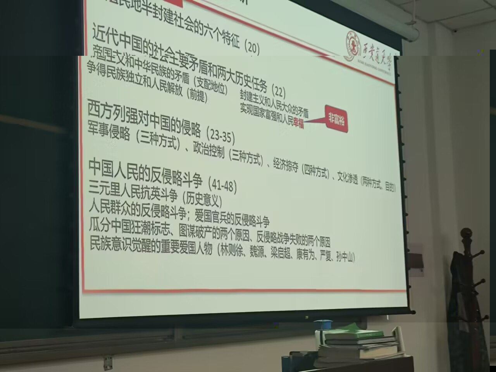

# 第一章

## 半殖民地半封建社会的六个特征(20)

## 近代中国主要社会矛盾和两大历史任务

### 矛盾

1. 帝国主义和中华民族的矛盾(支配地位)
2. 封建主义和人民大众的矛盾

### 两大历史任务

1. 取得民族独立和人民解放(前提)
2. 实现国家富强和人民幸福

## 西方列强的侵略

### 军事侵略

1. 发动侵略战争、屠杀中国人民
2. 侵占中国领土、划分视力范围
3. 勒索赔款、掠夺财富

### 政治控制

1. 控制中国的内政、外交
2. 镇压中国人民的反抗
3. 扶植、收买代理人

### 经济掠夺

1. 控制中国的通商口岸
2. 掠夺中国的关税自主权
3. 实行商品倾销和资本输出
4. 操纵中国的经济命脉

### 文化渗透

1. 披着宗教外衣、进行侵略活动
2. 为侵略中国制造舆论

## 中国人民的反侵略斗争(41-48)

### 三元里抗英(历史意义)

#### 历史意义：

  中国近代史上中国人民第一次大规模的反侵略武装斗争，显示了中国人民不甘屈服和敢于斗争的英雄气概。

### 人民群众的反侵略斗争；爱国官兵的反侵略斗争

#### 人民群众的反侵略斗争

1. 三元里抗英
2. 太平军多次重创侵略者
3. 台湾人民的反抗
4. 中法战争香港造船工人罢工
5. 马关条约台湾罢市
6. 八国联军侵华时义和团的反抗

#### 爱国官兵的反侵略斗争

1. 左宗棠收复新疆
2. 中法战争-冯子材
3. 甲午战争-丁汝昌、邓世昌、林永升、林泰曾

### 瓜分中国狂潮标志、图谋破产两个原因、反侵略战争失败两个原因

#### 瓜分中国狂潮标志

  1895年《马关条约》时，日本索要“赎辽费”；后1898-1899，德、俄、英、法、日等国竞相租借港湾和划分势力范围，掀起了瓜分中国狂潮。

#### 图谋破产两个原因

1. 帝国主义列强之间的矛盾和相互制约(重要原因)
   - 决定暂缓瓜分中国，借由清政府以华制华
2. 中华民族进行的不屈不挠的反侵略斗争
   - 义和团运动

#### 反侵略战争失败的两个原因

1. 社会制度的腐败(根本)
   - 正是腐败的中国半殖民地半封建的社会制度，阻碍了中国人民群众的广泛动员和抵抗
2. 经济技术的落后

### 民族意识觉醒的重要爱国人物

#### 师夷长技以制夷与早期维新思想

1. 开眼看世界第一人-林则徐-《四洲志》
2. 提出“师夷长技以制夷”-魏源-《海国图志》

#### 救亡图存和振兴中华

1. 梁启超-保国会演说
2. 严复-《救亡决论》《天演论》
3. 孙中山-兴中会
